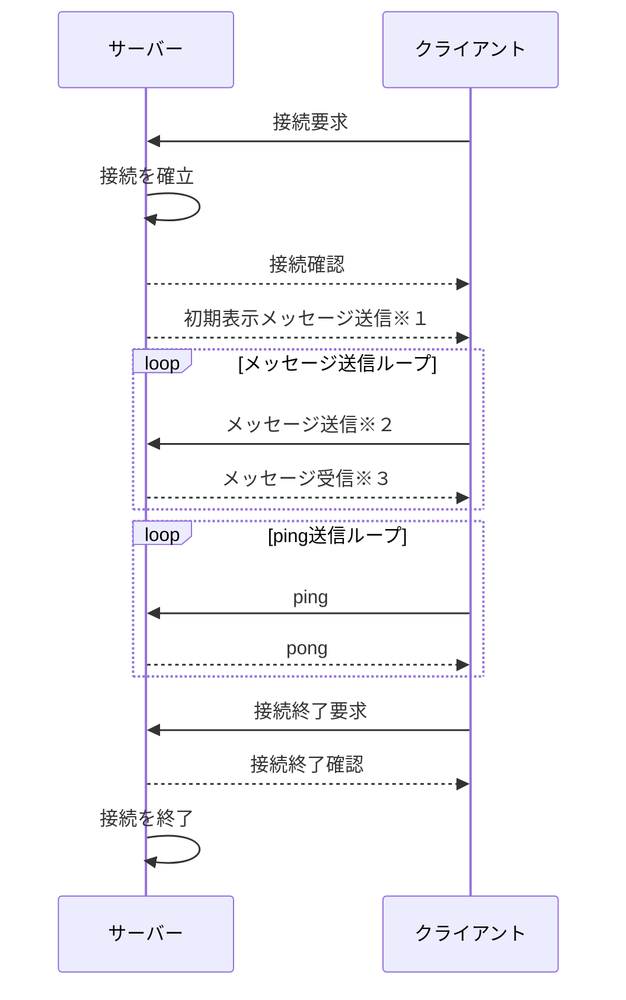

# チャット機能の設計

## メッセージの構造

- サーバーからクライアントに送るメッセージの構造
  `{messageID:string, userName:string, message:string}`
- クライアントからサーバーに送るメッセージの構造
  `{timeStamp:string, userID:string, message:string}`

### 補足

メッセージのIDはサーバーで付与する。
まず

## サーバー側の処理

**※１** 初期表示メッセージでは直近の３０件を送信する
**※２** メッセージ送信のレスポンスで付与されたIDを取得する
**※３** メッセージ受信

## クライアント側の処理
